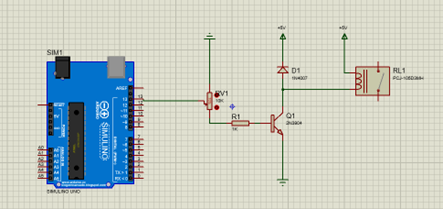
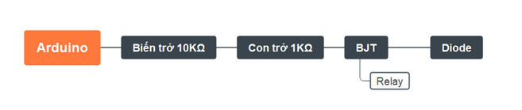

# BJT Relay Switching Circuit controlled by Arduino Uno

**(Project for Semiconductor Physics Course - Ho Chi Minh City University of Technology)**

## Overview

This project involves the design, simulation, assembly, and testing of a simple relay switching circuit using a Bipolar Junction Transistor (BJT) controlled by digital signals from an Arduino Uno R3. The goal was to understand the practical application of BJTs as electronic switches and the operating principles of relays.

## Features

*   Uses an NPN BJT (e.g., 2N3904 or similar) to switch a 5V relay.
*   Controlled by a digital output pin from an Arduino Uno.
*   Includes a flyback diode to protect the BJT from voltage spikes.
*   Potentiometer used to simulate variable input signal (for testing turn-on voltage).
*   Comparison between theoretical calculations, simulations (Proteus), and practical measurements.
*   Comparison with a commercial relay module featuring an optocoupler.

## Circuit Diagram

*Figure 1: Circuit schematic designed in Proteus.*

**(Block Diagram)**

*Figure 2: Block diagram of the system.*

## Components Used

*   Arduino Uno R3 (for 5V power supply and control signal)
*   10kΩ Potentiometer
*   1kΩ Resistor (Base resistor)
*   NPN BJT (e.g., 2N3904, C1815)
*   1N4007 Diode (Flyback diode)
*   5V Relay (e.g., Songle SRD-05VDC-SL-C or PCJ-105D3MH)
*   Breadboard and Jumper Wires
*   (For comparison) Commercial 5V Relay Module with Optocoupler

## How it Works

1.  The Arduino provides a 5V supply and a control signal (HIGH/LOW) from a digital pin (e.g., Pin 13).
2.  When the control signal is HIGH (5V), current flows through the base resistor (1kΩ) into the BJT's base.
3.  If the base current is sufficient (input voltage > V_BE(on) ≈ 0.7V), the BJT turns ON, acting like a closed switch between its collector and emitter.
4.  This allows current to flow from the 5V supply through the relay coil to ground, energizing the coil.
5.  The energized coil creates a magnetic field, pulling the relay's internal switch contacts.
6.  The flyback diode provides a path for the current induced in the coil when the BJT turns OFF, protecting the transistor.
7.  When the control signal is LOW (0V), the BJT turns OFF, interrupting current to the relay coil, and the relay de-energizes.

 [Link to Report](report/HCMUT_BJT_Relay_Report.pdf))*

## Results and Observations

*   **Theoretical Turn-on Input Voltage (Vi):** Calculated based on BJT parameters (V_BE(on)=0.7V, β=100) and relay coil resistance (Rc=70Ω), the minimum Vi for saturation was calculated to be approx. **1.39V**.
*   **Measured Turn-on Input Voltage (Vi):** Using a VOM, the relay was observed to reliably turn ON when Vi reached approx. **1.82V**. The difference could be due to actual component tolerances and specific BJT/relay characteristics.
*   **Commercial Module Turn-on Voltage:** A commercial relay module with an optocoupler was tested. Its turn-on input voltage was measured at approx. **1.45V**. The optocoupler provides isolation but might introduce slight differences in required input voltage/current compared to the direct BJT drive.

## Video Demonstration

A short video demonstrating the circuit assembly, operation, and testing:

*(Click the image to watch the video on YouTube)*

## Skills Demonstrated

*   **Circuit Design:** Designing a basic transistor switching circuit.
*   **Simulation:** Using Proteus (or similar) to simulate circuit behavior (implied).
*   **Hardware Prototyping:** Assembling circuits on a breadboard.
*   **Testing & Measurement:** Using a VOM to measure voltage, verifying circuit operation.
*   **Component Knowledge:** Understanding the function of BJT, Diode, Relay, Resistor, Potentiometer.
*   **Microcontroller Interfacing:** Using Arduino for power and digital control signals.
*   **Troubleshooting:** (Implied) Debugging potential issues during assembly/testing.
*   **Documentation:** Creating a technical report and organizing project files.

## Course Information

*   **Course:** Semiconductor Physics (Vật lý Bán dẫn) - L01
*   **Instructor:** Thầy Trần Hoàng Quân
*   **Institution:** Ho Chi Minh City University of Technology (Trường ĐH Bách Khoa - ĐHQG TP.HCM)
*   **Date:** June 2023
